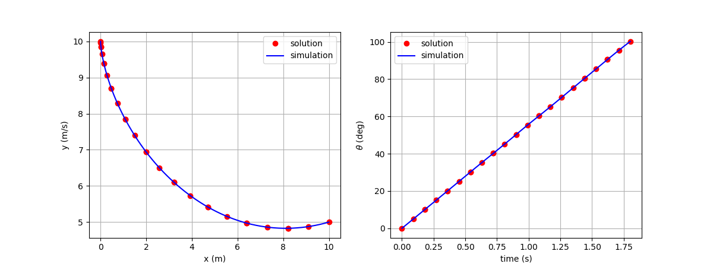

Dymos:  Open Source Optimization of Dynamic Multidisciplinary Systems
=====================================================================

[](https://travis-ci.com/OpenMDAO/dymos) [](https://coveralls.io/github/OpenMDAO/dymos?branch=master)

[](https://doi.org/10.21105/joss.02809)


Dymos is a framework for the simulation and optimization of dynamical systems within the OpenMDAO Multidisciplinary Analysis and Optimization environment.
Dymos leverages implicit and explicit simulation techniques to simulate generic dynamic systems of arbitary complexity.

The software has two primary objectives:
-   Provide a generic ODE integration interface that allows for the analysis of dynamical systems.
-   Allow the user to solve optimal control problems involving dynamical multidisciplinary systems.

Installation
------------

The default installation of the developmental version of Dymos will install the minimum number of prerequisites:

```
python -m pip install dymos
```

More advanced installation instructions are available [here](https://openmdao.github.io/dymos/installation.html).

Citation
--------

See our [overview paper](https://joss.theoj.org/papers/10.21105/joss.02809) in the Journal of Open Source Software

If you use Dymos in your work, please cite: 
```
@article{Falck2021,
  doi = {10.21105/joss.02809},
  url = {https://doi.org/10.21105/joss.02809},
  year = {2021},
  publisher = {The Open Journal},
  volume = {6},
  number = {59},
  pages = {2809},
  author = {Robert Falck and Justin S. Gray and Kaushik Ponnapalli and Ted Wright},
  title = {dymos: A Python package for optimal control of multidisciplinary systems},
  journal = {Journal of Open Source Software}
}
```


Documentation
-------------

Online documentation is available at [https://openmdao.github.io/dymos/](https://openmdao.github.io/dymos/)

Defining Ordinary Differential Equations
----------------------------------------

The first step in simulating or optimizing a dynamical system is to define the ordinary
differential equations to be integrated.  The user first builds an OpenMDAO model which has outputs
that provide the rates of the state variables.  This model can be an OpenMDAO model of arbitrary
complexity, including nested groups and components, layers of nonlinear solvers, etc.

Dymos solutions are constructed of one or more _Phases_.
When setting up a phase, we add state variables, dynamic controls, and parameters,
tell Dymos how the value of each should be connected to the ODE system, and tell Dymos
the variable paths in the system that contain the rates of our state variables that are to be
integrated.

Integrating Ordinary Differential Equations
-------------------------------------------

Dymos's solver-based pseudspectral transcriptions
provide the ability to numerically integrate the ODE system it is given.
Used in an optimal control context, these provide a shooting method in
which each iteration provides a physically viable trajectory.

Pseudospectral Methods
----------------------

Dymos currently supports the Radau Pseudospectral Method and high-order
Gauss-Lobatto transcriptions.  These implicit techniques rely on the
optimizer to impose "defect" constraints which enforce the physical
accuracy of the resulting trajectories.  To verify the physical
accuracy of the solutions, Dymos can explicitly integrate them using
variable-step methods.

Solving Optimal Control Problems
--------------------------------

Dymos uses the concept of _Phases_ to support optimal control of dynamical systems.
Users connect one or more Phases to construct trajectories.
Each Phase can have its own:

-   Optimal Control Transcription (Gauss-Lobatto or Radau Pseudospectral)
-   Equations of motion
-   Boundary and path constraints

Dymos Phases and Trajectories are ultimately just OpenMDAO Groups that can exist in
a problem along with numerous other models, allowing for the simultaneous
optimization of systems and dynamics.

```python
import numpy as np
import openmdao.api as om
import dymos as dm
import matplotlib.pyplot as plt


class BrachistochroneEOM(om.ExplicitComponent):
    def initialize(self):
        self.options.declare('num_nodes', types=int)

    def setup(self):
        nn = self.options['num_nodes']

        # Inputs
        self.add_input('v',
                       shape=(nn,),
                       desc='velocity',
                       units='m/s')

        self.add_input('theta',
                       shape=(nn,),
                       desc='angle of wire',
                       units='rad')

        self.add_output('xdot',
                        shape=(nn,),
                        desc='velocity component in x',
                        units='m/s')

        self.add_output('ydot',
                        shape=(nn,),
                        desc='velocity component in y',
                        units='m/s')

        self.add_output('vdot',
                        val=np.zeros(nn),
                        desc='acceleration magnitude',
                        units='m/s**2')

        self.add_output('check',
                        val=np.zeros(nn),
                        desc='A check on the solution: v/sin(theta) = constant',
                        units='m/s')

        # Use OpenMDAO's ability to automatically determine a sparse "coloring" of the jacobian
        # for this ODE component.
        self.declare_coloring(wrt='*', method='cs')

    def compute(self, inputs, outputs):
        theta = inputs['theta']
        cos_theta = np.cos(theta)
        sin_theta = np.sin(theta)
        v = inputs['v']

        outputs['vdot'] = 9.80665 * cos_theta
        outputs['xdot'] = v * sin_theta
        outputs['ydot'] = -v * cos_theta
        outputs['check'] = v / sin_theta


# Define the OpenMDAO problem
p = om.Problem(model=om.Group())

# Define a Trajectory object
traj = dm.Trajectory()
p.model.add_subsystem('traj', subsys=traj)

# Define a Dymos Phase object with GaussLobatto Transcription
phase = dm.Phase(ode_class=BrachistochroneEOM,
                 transcription=dm.Radau(num_segments=10, order=3))
traj.add_phase(name='phase0', phase=phase)

# Set the time options
phase.set_time_options(fix_initial=True,
                       duration_bounds=(0.5, 10.0))

# Set the state options
phase.add_state('x', rate_source='xdot',
                fix_initial=True, fix_final=True)
phase.add_state('y', rate_source='ydot',
                fix_initial=True, fix_final=True)
phase.add_state('v', rate_source='vdot',
                fix_initial=True, fix_final=False)

# Define theta as a control.
phase.add_control(name='theta', units='rad',
                  lower=0, upper=np.pi)

# Minimize final time.
phase.add_objective('time', loc='final')

# Set the driver.
p.driver = om.ScipyOptimizeDriver()

# Allow OpenMDAO to automatically determine our sparsity pattern
# for TOTAL derivatives. Doing so can significantly speed up the
# execution of dymos.
p.driver.declare_coloring()

# Setup the problem
p.setup()

# Now that the OpenMDAO problem is setup, we can guess the
# values of time, states, and controls.
p.set_val('traj.phase0.t_duration', 2.0)

# States and controls here use a linearly interpolated
# initial guess along the trajectory.
p.set_val('traj.phase0.states:x',
          phase.interpolate(ys=[0, 10], nodes='state_input'),
          units='m')

p.set_val('traj.phase0.states:y',
          phase.interpolate(ys=[10, 5], nodes='state_input'),
          units='m')

p.set_val('traj.phase0.states:v',
          phase.interpolate(ys=[0, 5], nodes='state_input'),
          units='m/s')

p.set_val('traj.phase0.controls:theta',
          phase.interpolate(ys=[5, 45], nodes='control_input'),
          units='deg')

# Use Dymos' run_problem method to run the driver, simulate the results,
# and record the results to 'dymos_solution.db' and 'dymos_simulation.db'.
dm.run_problem(p, simulate=True)

# Load the solution and simulation files.
sol_case = om.CaseReader('dymos_solution.db').get_case('final')
sim_case = om.CaseReader('dymos_simulation.db').get_case('final')

# Plot the results
fig, axes = plt.subplots(nrows=1, ncols=2, figsize=(12, 4.5))

axes[0].plot(sol_case.get_val('traj.phase0.timeseries.states:x'),
             sol_case.get_val('traj.phase0.timeseries.states:y'),
             'ro', label='solution')

axes[0].plot(sim_case.get_val('traj.phase0.timeseries.states:x'),
             sim_case.get_val('traj.phase0.timeseries.states:y'),
             'b-', label='simulation')

axes[0].set_xlabel('x (m)')
axes[0].set_ylabel('y (m/s)')
axes[0].legend()
axes[0].grid()

axes[1].plot(sol_case.get_val('traj.phase0.timeseries.time'),
             sol_case.get_val('traj.phase0.timeseries.controls:theta',
                              units='deg'),
             'ro', label='solution')

axes[1].plot(sim_case.get_val('traj.phase0.timeseries.time'),
             sim_case.get_val('traj.phase0.timeseries.controls:theta',
                              units='deg'),
             'b-', label='simulation')

axes[1].set_xlabel('time (s)')
axes[1].set_ylabel(r'$\theta$ (deg)')
axes[1].legend()
axes[1].grid()

plt.show()
```


